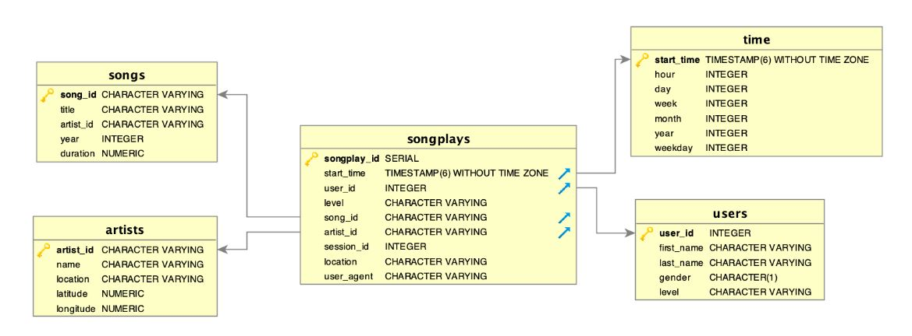

#  Data Warehouse: ETL with AWS S3 and Redshift

[](https://travis-ci.org/joemccann/dillinger)

## Summary
- [Introduction](#Introduction)
- [The Goal](#The-Goal)
- [Tool](#Tool)
- [Database & ETL Pipeline](#Database-&-ETL-Pipeline)
- [How to Run](#How-to-Run)
- [Exmaple Queries](#Exmaple-Queries)
- [Code Explanations](#Code-Explanations)
***
### Introduction

Sparkify is a music streaming start-up company. The have collected many songs and user activities data through their 
music app. And the analytics team is particularly interested in understanding what songs users are listening to. 
Currently, their data resides in a directory of JSON logs on user activity on the app, as well as a directory with JSON 
metadata on the songs in their app. However, this cannot provid an easy way to query the data. 
***
### The Goal
The goal is to create a database schema and ETL pipeline for this analysis. The database and ETL pipeline will be 
tested by running queries given by the analytics team from Sparkify and compare results with their expected results.
***
### Tool
[AWS S3](https://aws.amazon.com/s3/): Customers of all sizes and industries can use it to store and protect any mount of data for a range of use cases, such as websites, mobile applications, backup and restore, archive, enterprise applications, IoT devices, and big data analytics. 

In this project, Song and Log data files are stored in two public ``S3 Buckets``. The file path can be found in ``dwh.cfg`` file.

[AWS Redshift](https://aws.amazon.com/redshift/): Amazon Redshift is a fast, scalable data warehouse that makes it simple and cost-effective to analyze all your data across your data warehouse and data lake.

In this project, two staging tables, one fact table and four dimension tables are created in Redshift.

***
### Database & ETL Pipeline
Song and Log datasets are saved in AWS S3. A star schema is created including one fact table: **songplays**, and four dimension tables: **users**, **songs**, **artists** and **time**. The Song data and Log data are initially ingested into two stage tables. Then another pipeline is built to transfer data from stage tables to 5 above tables. 

The schema is shown as below:


***
### How to Run
1. Create a Redshift cluster. Multi-node cluster is highly recommended. Copy Song files from S3 to Staging-song tables is really time comsuing and a 16-node cluster helps to reduce the copy time.
2. Create a IAM role for Redshift and give a S3ReadOnly access.
3. Fill Redshift configuration and ARN info into ```dhw.cfg```
4. Run Following commands
```sh
$ python3 create_tables.py
$ python3 etl.py
```
5. Open Redshift Query Eidtor and write your query in the eidtor.

***
### Exmaple Queries
* What are the most popular songs in 2018? 

```SQL
SELECT songs.title, songs.song_id
FROM songs
WHERE song_id = 
(SELECT a.song_id
FROM
(SELECT songs.song_id,  songs.title
FROM songplays JOIN songs ON songplays.song_id = songs.song_id) a
GROUP BY a.song_id
ORDER BY count(a.song_id) DESC
LIMIT 1)
```

**You're The One: 111 times!**
***
### Code Explanations
**create_tables.py:** drops and creates your tables. Run this file to reset your tables before each time you run 
your ETL scripts.

**sql_queries.py:** contains all your sql queries, and is imported into the last three files above.

**etl.py**: transfer data from S3 to two stage tables then injest into fact and dimension tables.

**dwh.cfg:** configuration files containing info on Redshift cluster.